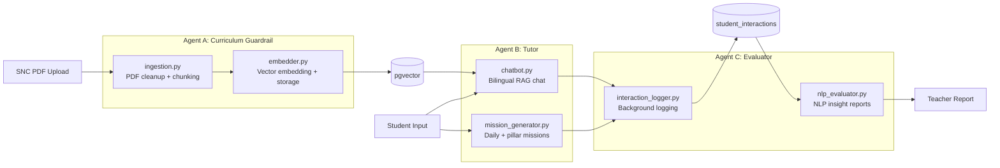

# Three-Agent System

PrimePal's AI capabilities are organized into three agents, each with a distinct pedagogical role. All agent code lives under `backend/app/agents/`.



---

## Agent A: Curriculum Guardrail

**Purpose**: Enforce SNC (Single National Curriculum) vocabulary boundaries. Ensures the AI only uses age-appropriate, locally approved content.

**Location**: `backend/app/agents/curriculum_agent/`

### ingestion.py -- Text Extraction & Chunking (Feature 3)

Converts raw PDF documents into clean, metadata-tagged chunks ready for vectorization.

**Constants**:
- `CHUNK_SIZE = 1000` characters
- `CHUNK_OVERLAP = 200` characters
- `MIN_CHUNK_LENGTH = 50` characters (below this, chunks are discarded as artifacts)

```python
def clean_snc_text(text: str) -> str:
    """
    Remove standard SNC textbook noise from extracted PDF text.
    Strips: isolated page numbers, "Single National Curriculum" headers,
    runs of 3+ blank lines collapsed to 2.
    """

def chunk_documents(
    documents: list,         # LangChain Document objects from PyPDFLoader
    grade_level: int,        # 1-6
    book_title: str,
) -> list[dict[str, Any]]:
    """
    Split documents into overlapping chunks with RecursiveCharacterTextSplitter.
    Tags each chunk with metadata: {grade_level, book_title, chunk_id}.
    Separators: ["\n\n", "\n", ".", " ", ""]
    Returns list of {"content": str, "metadata": dict}.
    Chunks shorter than MIN_CHUNK_LENGTH are discarded.
    """
```

### embedder.py -- Vector Storage & Curricular Tagging (Feature 4)

Embeds text chunks using HuggingFace `all-MiniLM-L6-v2` (local, free, 384 dims) and stores them in Supabase pgvector.

```python
def _get_embeddings_model() -> HuggingFaceEmbeddings:
    """Return HuggingFaceEmbeddings instance (all-MiniLM-L6-v2, runs locally)."""

async def embed_and_store_chunks(
    chunks: list[dict],              # Output of chunk_documents(): [{content, metadata}]
    supabase_admin_client,           # Service-role client (bypasses RLS)
) -> int:
    """
    Generate vector embeddings via aembed_documents() (batches internally).
    Bulk-insert records into snc_knowledge_base table.
    Returns count of inserted records. Raises on error.
    """
```

**Table**: `snc_knowledge_base` with columns: `content` (text), `metadata` (JSONB), `embedding` (VECTOR(1536)).

**Triggered by**: `POST /api/v1/curriculum/upload` in `backend/app/api/v1/endpoints/curriculum.py`.

---

## Agent B: Tutor

**Purpose**: Drive learning across all four language pillars (Reading, Writing, Listening, Speaking). Generates curriculum-aligned missions and provides bilingual conversational tutoring.

**Location**: `backend/app/agents/tutor_agent/`

### mission_generator.py -- Mission Generation (Features 5, 6, 11)

Generates both daily 3-question missions and full 10-question pillar missions using OpenAI structured output.

**Key Pydantic schemas** (also serve as structured output targets for the LLM):

```python
class QuestionOption(BaseModel):
    id: str        # "a", "b", "c", "d"
    text: str
    emoji: str | None = None

class MissionQuestion(BaseModel):
    id: int
    task_type: str           # 13 task types across 4 pillars
    pillar: str              # reading, writing, listening, speaking
    question: str
    difficulty: str          # easy, medium, hard
    points_value: int        # 5, 10, 20
    correct_answer: str
    emoji_hint: str
    urdu_hint: str           # Bilingual scaffolding
    # Optional fields per task type:
    options: list[QuestionOption] | None = None
    passage: str | None = None
    audio_text: str | None = None
    image_context: str | None = None
    image_options: list[QuestionOption] | None = None
    word_bank: list[str] | None = None
    correct_order: list[str] | None = None
    word_with_blanks: str | None = None
    letter_options: list[str] | None = None
    sentence_start: str | None = None

class DailyMissions(BaseModel):
    topic: str
    questions: list[MissionQuestion]

class PillarMissions(BaseModel):
    questions: list[MissionQuestion]
```

**Public functions**:

```python
async def generate_daily_missions(
    grade_level: int,
    context_chunks: list[str],    # SNC passages from match_snc_documents RPC
    active_topics: list[str],
    is_frustrated: bool = False,  # Triggers "Confidence Builder" mode
) -> DailyMissions:
    """
    Generate 3 grade-appropriate questions grounded in SNC context.
    Uses ChatOpenAI(gpt-4o-mini).with_structured_output(DailyMissions).
    Temperature 0.7, timeout 12s.
    
    Confidence Builder mode (is_frustrated=True):
    - Reduces vocabulary complexity by 1-2 grade levels
    - Makes correct answers obvious
    - Ensures 2/3 questions are easy wins (>90% success probability)
    """

async def generate_pillar_missions(
    pillar: str,                          # reading|writing|listening|speaking
    grade_level: int,
    active_topics: list[str],
    student_id: str,
    student_weaknesses: list[str],        # Recent failed topics (max 5)
    is_frustrated: bool = False,
    performance_profile: dict | None = None,  # Adaptive difficulty data
) -> list[dict]:
    """
    Generate exactly 10 pillar-specific questions with adaptive difficulty.
    Uses ChatOpenAI(gpt-4o-mini).with_structured_output(PillarMissions).
    Temperature 0.7, timeout 60s.
    
    Task type distribution per pillar (from PILLAR_TASK_CONFIGS):
      Reading:   sentence_picture_match(3), odd_one_out(3), fill_blank_word_bank(2), passage_true_false(2)
      Writing:   sentence_scramble(4), missing_letter(3), guided_translation(3)
      Listening: listen_and_choose(4), simon_says(3), listen_and_spell(3)
      Speaking:  repeat_after_me(4), what_is_this(3), finish_the_sentence(3)
    
    Default difficulty: 3 easy (5pts), 4 medium (10pts), 3 hard (20pts).
    Adjusted by performance_profile when present.
    """
```

**Constants**:
- `MAX_WEAKNESS_ITEMS = 5`
- `PILLAR_QUESTIONS_COUNT = 10`
- `MULTIPLE_CHOICE_OPTIONS = 4`
- `DAILY_QUESTIONS_COUNT = 3`

### chatbot.py -- Bilingual RAG Chat (Features 5, 7)

Implements the guardrailed bilingual tutor pipeline: translate -> embed -> retrieve -> generate.

```python
class TutorResponse(BaseModel):
    bilingual_reply: str  # Minglish code-switching response (shown by default)
    english_reply: str    # Pure English version (shown when toggle pressed)

async def translate_to_english(query: str) -> str:
    """
    Translate Roman Urdu / Minglish to standard English using gpt-4o-mini.
    Returns input unchanged if already English. Temperature=0, max_retries=3.
    """

async def retrieve_grade_filtered_chunks(
    query: str,
    grade_level: int,
    supabase_admin_client,
    match_count: int = 5,
) -> list[str]:
    """
    Embed query with all-MiniLM-L6-v2, call match_snc_documents RPC
    with grade_level_filter. Grade filter runs in SQL WHERE clause
    BEFORE vector math. Returns list of content strings.
    Empty list (not exception) when no data ingested for this grade.
    """

async def get_guardrailed_response(
    original_message: str,       # Raw student input (may be Urdu/Minglish)
    translated_message: str,     # English translation
    grade_level: int,
    context_chunks: list[str],   # SNC passages from retrieval
) -> TutorResponse:
    """
    Single LLM call with structured output returning both bilingual
    and pure English replies. Uses gpt-4o-mini (settings.CHAT_MODEL).
    Temperature 0.3, max_retries=3.
    
    System prompt rules:
    1. bilingual_reply: Friendly Minglish (English + Roman Urdu)
    2. english_reply: Same content in pure English
    3. Only Grade N vocabulary
    4. 2-3 sentences, warm and encouraging
    5. Based ONLY on SNC curriculum context
    """

async def stream_guardrailed_response(
    query: str,
    context_chunks: list[str],
    grade_level: int,
) -> AsyncGenerator[str, None]:
    """Stream bilingual tutor response token by token (for SSE endpoint)."""
```

**The Three-Layer Guardrail**:
1. `match_snc_documents` RPC: `WHERE (metadata->>'grade_level')::int = grade_level_filter` runs before cosine distance
2. Endpoint logic: `grade_level` resolved from `classrooms` table via student JWT's `classroom_id`, never from request body
3. System prompt: LLM instructed to use only Grade N vocabulary even when context is sparse

---

## Agent C: Evaluator

**Purpose**: Silently monitor student progress and produce actionable teacher-facing reports.

**Location**: `backend/app/agents/evaluator_agent/`

### interaction_logger.py -- Background Logging (Feature 8)

Records every student-AI interaction into the `student_interactions` table.

```python
def log_interaction(
    *,
    student_id: str,
    classroom_id: str,
    grade_level: int,
    interaction_type: str,           # 'chat'|'mission_mc'|'mission_fill'|'spelling_bee'|'speaking_practice'|'story_time'
    original_message: str | None = None,
    translated_message: str | None = None,
    correct: bool | None = None,     # None for chat interactions
    context_used: bool = False,
    pillar: str | None = None,       # 'reading'|'writing'|'listening'|'speaking'
    score: int | None = None,        # Points awarded
) -> None:
    """
    Insert one interaction record into student_interactions.
    Synchronous by design -- runs inside FastAPI BackgroundTasks thread pool.
    Uses get_supabase_admin() to bypass RLS for inserts.
    Errors silently swallowed so logging failure never crashes student response.
    """
```

**Called from**: chat endpoint, missions endpoint, spelling bee, speaking, story time.

### nlp_evaluator.py -- NLP Insight Generator (Feature 9)

Generates structured teacher-facing insight reports from student interaction data.

```python
class StudentInsightReport(BaseModel):
    engagement_level: str             # "High" (>=10) | "Medium" (4-9) | "Low" (<4)
    mission_accuracy_pct: int         # 0-100
    total_interactions: int
    strengths: list[str]              # 2-3 bullet points
    areas_for_improvement: list[str]  # 2-3 bullet points
    recommended_topics: list[str]     # 2-3 SNC topic suggestions
    teacher_note: str                 # 1-2 sentence summary

async def evaluate_interactions(
    student_id: str,
    grade_level: int,
    supabase_admin_client,
    limit: int = 30,
) -> StudentInsightReport:
    """
    Pipeline:
      1. Fetch last 30 interactions from student_interactions table
      2. Compute stats locally:
         - total_interactions count
         - mission_count (type in mission_mc, mission_fill)
         - correct_count
         - chat_count
         - context_used_count
      3. Sample up to 10 recent chat messages for qualitative analysis
      4. Call gpt-4o-mini with_structured_output(StudentInsightReport)
    
    Temperature 0.3, max_retries=3.
    """
```

**Called by**: Evaluator endpoint module (`backend/app/api/v1/endpoints/evaluator.py`).
