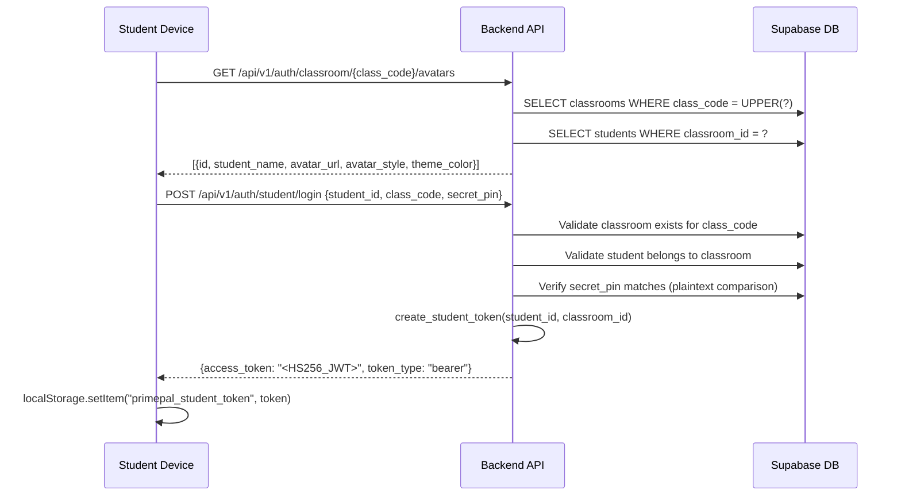

# Authentication Flows

PrimePal uses two completely separate authentication systems. Teachers authenticate via Supabase GoTrue (standard OAuth). Students authenticate via custom PyJWT tokens because they are "ghost profiles" -- not Supabase Auth users. These two token systems must never be mixed.

---

## Architecture Overview

```mermaid
graph TB
    subgraph "Teacher Auth (Supabase GoTrue)"
        TL[Teacher Login Page<br/>email + password] -->|supabase.auth.signInWithPassword| SB[Supabase GoTrue]
        SB -->|GoTrue JWT| TS[Teacher Session<br/>stored in Supabase client]
        TS -->|Bearer token| BE1[Backend: get_current_teacher]
        BE1 -->|supabase.auth.get_user| SB
    end

    subgraph "Student Auth (Custom PyJWT)"
        S1[Class Code Entry] -->|GET /auth/classroom/{code}/avatars| BE2[Avatar Roster]
        S2[Avatar + PIN Select] -->|POST /auth/student/login| BE3[Validate + Mint JWT]
        BE3 -->|HS256 JWT| LS[localStorage<br/>primepal_student_token]
        LS -->|Bearer token| BE4[Backend: get_current_student]
    end

    subgraph "Admin Auth (GoTrue + role check)"
        AL[Admin Login] -->|Same as teacher| SB
        SB -->|GoTrue JWT| AE[Backend: get_current_admin]
        AE -->|Check teachers.role = admin| DB[(teachers table)]
    end
```

---

## Teacher Authentication (Supabase GoTrue)

Teachers are real Supabase Auth users. Authentication is handled entirely by Supabase GoTrue.

### Login Flow
1. Teacher visits `/teacher/login`
2. Frontend calls `supabase.auth.signInWithPassword({ email, password })`
3. Supabase returns a GoTrue JWT stored in the Supabase JS client session
4. Frontend reads token via `supabase.auth.getSession()` in `getTeacherHeaders()`
5. Token sent as `Authorization: Bearer <goTrue_jwt>` on every backend call

### Backend Validation

**File**: `backend/app/core/security.py`

```python
async def get_current_teacher(
    credentials: HTTPAuthorizationCredentials = Depends(_bearer),
) -> dict:
    """
    FastAPI dependency -- validates a Supabase GoTrue JWT.
    
    Steps:
      1. Call supabase.auth.get_user(token) to validate with GoTrue
      2. Extract user_id from response
      3. Check Redis cache for teacher role (key: teacher_role:{user_id}, TTL: 1h)
      4. Cache miss: query teachers table for role via service-role client
      5. Return {"id": user_id, "role": str, "is_admin": bool}
    
    Raises 401 if token is invalid or expired.
    """
```

### Token Lifecycle
- **Issued by**: Supabase GoTrue
- **Algorithm**: RS256 (Supabase-managed)
- **Expiry**: Managed by Supabase (default 1h, auto-refreshed by Supabase JS client)
- **Storage**: Supabase JS client session (browser cookies/storage)
- **Validation**: `supabase.auth.get_user(token)` on every request
- **Role caching**: Redis `teacher_role:{user_id}` with 1h TTL

---

## Student Authentication (Custom PyJWT)

Students are "ghost profiles" -- records in the `students` table without Supabase Auth accounts. They authenticate via a visual login flow using class codes, avatar selection, and 4-digit PINs.

### Login Flow



### Auth Endpoints

**File**: `backend/app/api/v1/endpoints/auth.py`

| Endpoint | Method | Auth | Purpose |
|---|---|---|---|
| `/auth/classroom/{class_code}/avatars` | GET | Public | Fetch student roster for visual login grid |
| `/auth/student/login` | POST | Public | Validate class_code + student_id + secret_pin, issue JWT |
| `/auth/student/profile` | PATCH | Student JWT | Update avatar_style and/or theme_color |
| `/auth/student/{student_id}/pin` | PATCH | Teacher GoTrue | Reset student's 4-digit PIN (teacher must own classroom) |
| `/auth/me` | GET | Teacher GoTrue | Get teacher profile with role |

### Token Minting & Validation

**File**: `backend/app/core/security.py`

```python
ALGORITHM = "HS256"
TOKEN_EXPIRE_HOURS = 24

def create_student_token(student_id: str, classroom_id: str) -> str:
    """
    Mint a signed JWT for a student session.
    Payload: {sub: student_id, classroom_id, role: "student", exp: now+24h}
    Signed with settings.STUDENT_JWT_SECRET.
    """

def decode_student_token(token: str) -> dict:
    """
    Decode and validate a student JWT.
    Checks: valid HS256 signature, not expired, role == "student".
    Raises HTTPException 401 on expired/invalid, 403 if wrong role.
    """

def get_current_student(
    credentials: HTTPAuthorizationCredentials = Depends(_bearer),
) -> dict:
    """
    FastAPI dependency -- extracts and validates student JWT from
    Authorization header. Returns full payload dict:
    {sub: student_id, classroom_id: str, role: "student", exp: datetime}
    """
```

### Token Lifecycle
- **Issued by**: `create_student_token()` in `security.py`
- **Algorithm**: HS256 with `STUDENT_JWT_SECRET` env var
- **Expiry**: 24 hours (hardcoded `TOKEN_EXPIRE_HOURS = 24`)
- **Payload**: `{sub: student_id, classroom_id, role: "student", exp: datetime}`
- **Storage**: `localStorage['primepal_student_token']` on the client
- **Validation**: `decode_student_token()` on every request
- **No refresh mechanism**: Student re-authenticates after 24h

### PIN Validation
- PIN is a 4-digit string validated via `@field_validator` in `StudentLoginRequest`
- Stored plaintext in `students.secret_pin`
- Direct string comparison: `student_res.data["secret_pin"] != request.secret_pin`
- Teachers can reset PINs via `PATCH /auth/student/{student_id}/pin` (verifies teacher owns the classroom)
- Valid avatar styles: `{"adventurer", "bottts", "fun-emoji", "pixel-art", "lorelei"}`

---

## Admin Authentication

Admin is a specialized teacher role, not a separate auth system.

**File**: `backend/app/core/security.py`

```python
async def get_current_admin(
    credentials: HTTPAuthorizationCredentials = Depends(_bearer),
) -> dict:
    """
    FastAPI dependency -- validates an admin JWT.
    
    Steps:
      1. Validate GoTrue JWT via supabase.auth.get_user(token)
      2. Check Redis cache for role (teacher_role:{user_id})
      3. Cache miss: query teachers.role via service-role client
      4. If role != "admin": raise 403 "Access denied -- admin role required"
      5. Cache the role result (both admin and non-admin) for 1h
      6. Return {"id": user_id}
    
    Raises 403 if not admin, 401 if token invalid.
    """
```

### Admin vs Teacher
- Same login flow (Supabase GoTrue email/password)
- Same JWT format (GoTrue RS256)
- Differentiated by `teachers.role` column: `"admin"` vs `"teacher"`
- Admin endpoints use `get_current_admin()` which enforces the role check
- Teacher endpoints use `get_current_teacher()` which returns `is_admin` but does not restrict
- Admin accounts created via invite codes generated by existing admins

---

## Auth Decision Matrix

| Actor | Token System | Where Stored | Expiry | Backend Dependency |
|---|---|---|---|---|
| Teacher | Supabase GoTrue (RS256) | Supabase JS session | ~1h (auto-refresh) | `get_current_teacher()` |
| Student | Custom PyJWT (HS256) | `localStorage` | 24h (no refresh) | `get_current_student()` |
| Admin | Supabase GoTrue (RS256) | Supabase JS session | ~1h (auto-refresh) | `get_current_admin()` |

---

## Security Notes

1. **Separate secrets**: `STUDENT_JWT_SECRET` is completely independent from Supabase's JWT secret
2. **Role caching**: Teacher/admin roles are cached in Redis for 1 hour to avoid repeated DB queries
3. **Grade-level guardrail**: The `classroom_id` in the student JWT is used to resolve `grade_level` server-side -- students cannot override their grade
4. **Service-role bypass**: `get_supabase_admin()` uses the service-role key to bypass RLS for trusted operations
5. **PIN storage**: PINs are stored plaintext (appropriate for primary school children on shared devices; not a high-security model)
6. **Class code case-insensitive**: Class codes are uppercased before lookup (`class_code.upper()`)
