# Data Flow & Request Lifecycles

This document traces the component chain for every major request type in PrimePal.

---

## 1. Curriculum Upload (Teacher)

Full pipeline: PDF -> extract -> chunk -> embed -> store in pgvector.

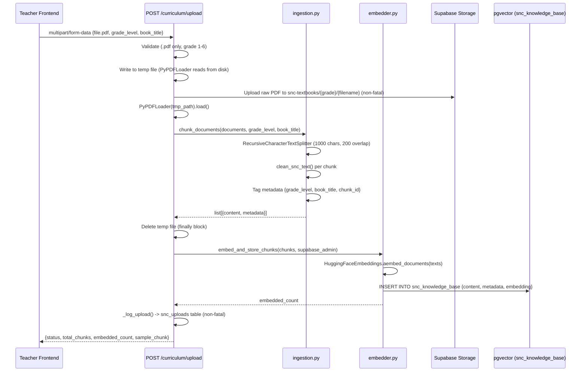

**Key files**: `backend/app/api/v1/endpoints/curriculum.py`, `backend/app/agents/curriculum_agent/ingestion.py`, `backend/app/agents/curriculum_agent/embedder.py`

**Also**: `POST /curriculum/embed` -- standalone endpoint for re-embedding pre-processed chunks without PDF upload.

**Also**: `GET /curriculum/uploads` -- returns upload history for the current teacher, optionally filtered by grade_level.

---

## 2. Bilingual Chat (Student)

RAG pipeline: translate -> embed -> retrieve -> generate bilingual response.

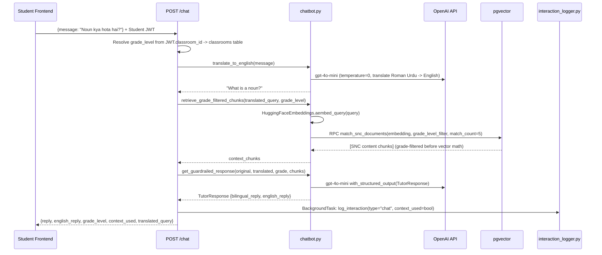

**Streaming variant**: `POST /chat/stream` returns SSE events:
- `{"type": "status", "content": "Thinking..."}`
- `{"type": "token", "content": "<token>"}` (repeated)
- `{"type": "done"}`

Uses `stream_guardrailed_response()` and logs interaction via `asyncio.to_thread()` after stream completes.

**Key files**: `backend/app/api/v1/endpoints/chat.py`, `backend/app/agents/tutor_agent/chatbot.py`

---

## 3. Mission Generation (Student)

### Daily Missions (3 questions)

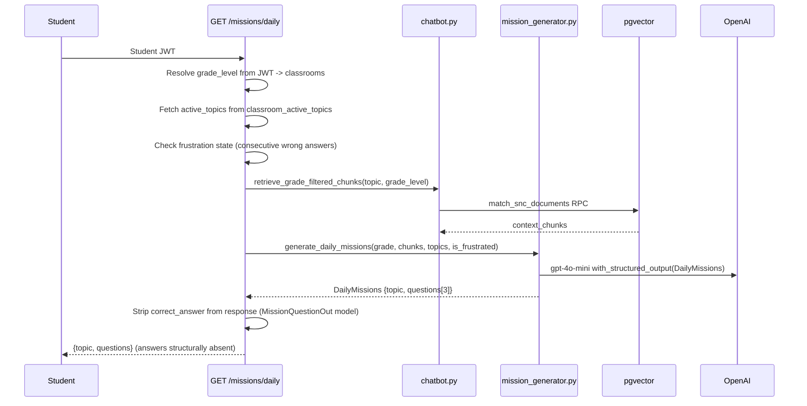

### Pillar Missions (10 questions)

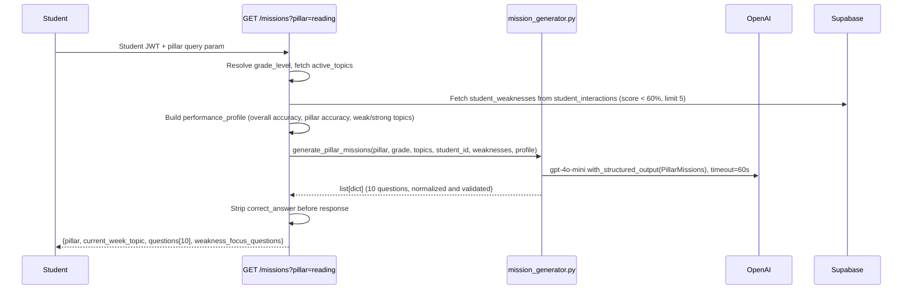

**Key files**: `backend/app/api/v1/endpoints/missions.py`, `backend/app/agents/tutor_agent/mission_generator.py`

---

## 4. Mission Completion & Points

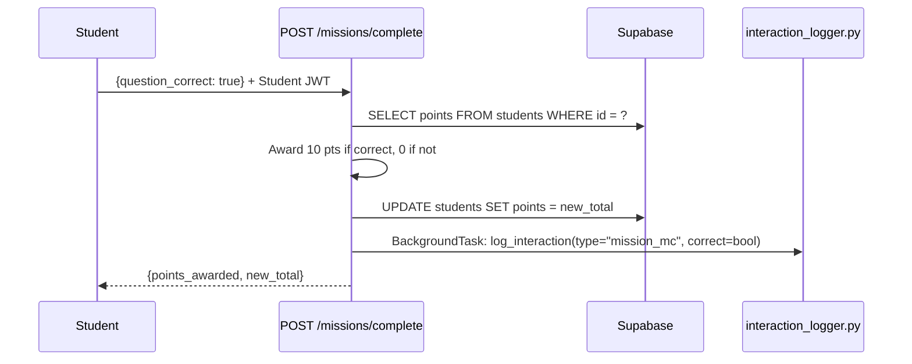

### Batch Interaction Logging (Pillar Games)

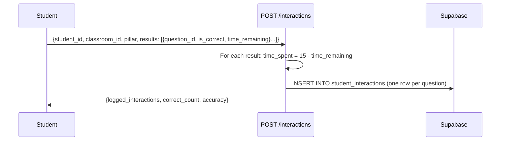

**Key files**: `backend/app/api/v1/endpoints/missions.py`, `backend/app/api/v1/endpoints/interactions.py`

---

## 5. Spelling Bee (Student)

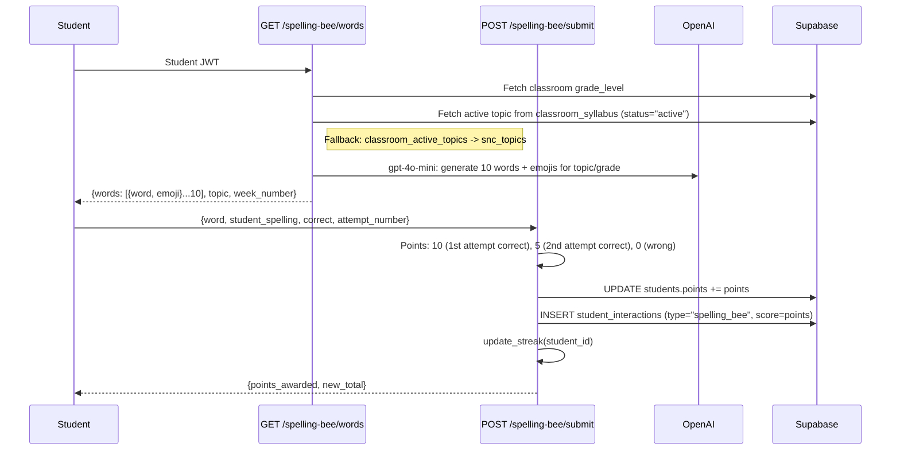

**Key file**: `backend/app/api/v1/endpoints/spelling_bee.py`

---

## 6. Story Time (Student)

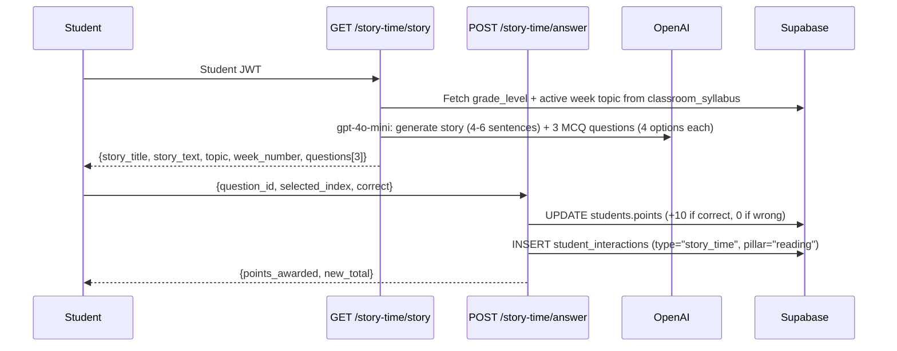

**Key file**: `backend/app/api/v1/endpoints/story_time.py`

---

## 7. Speaking Practice (Student)

### Basic Evaluation (Text Transcript)

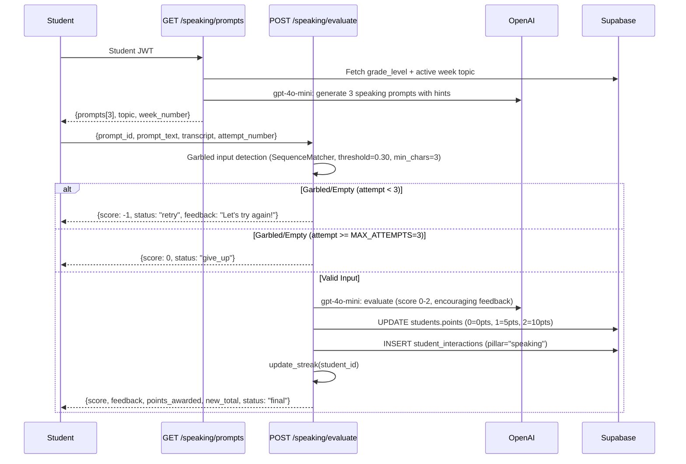

### Pro Evaluation (Audio + Word-Level Pronunciation)

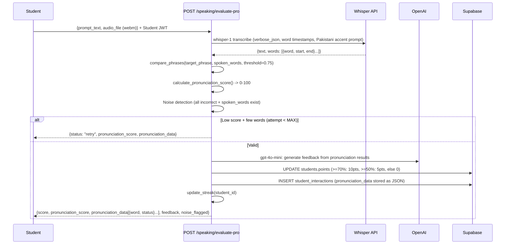

**Key file**: `backend/app/api/v1/endpoints/speaking.py`
**Utility**: `backend/app/utils/pronunciation.py` (compare_phrases, calculate_pronunciation_score)

---

## 8. Daily Rewards / Surprise Chest (Student)

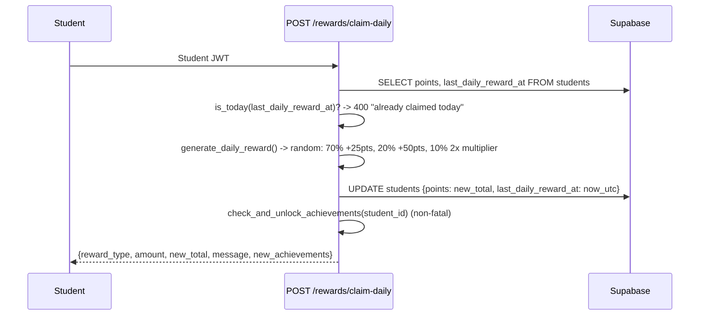

**Anti-cheat**: Server-side UTC timestamp comparison via `is_today()`. Students cannot claim twice in the same calendar day regardless of timezone.

**Other rewards endpoints**:
- `GET /rewards/status` -- check if claimed today
- `GET /rewards/daily-summary` -- today_points, total_points, missions_today (cached 2min)
- `GET /rewards/streak` -- current_streak, longest_streak, last_activity_date

**Key file**: `backend/app/api/v1/endpoints/rewards.py`

---

## 9. NLP Insight Report (Teacher)

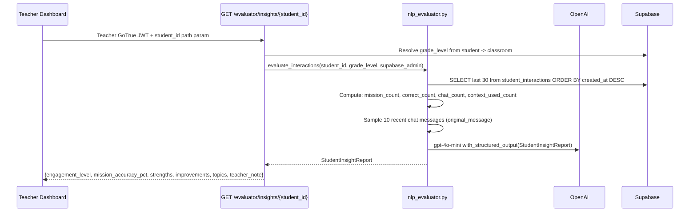

**Key files**: `backend/app/api/v1/endpoints/evaluator.py`, `backend/app/agents/evaluator_agent/nlp_evaluator.py`

---

## Cross-Cutting Patterns

### Grade-Level Guardrail
Every student-facing endpoint resolves `grade_level` from:
1. Student JWT contains `classroom_id`
2. `classrooms` table lookup returns `grade_level`
3. Grade injected into vector queries (`match_snc_documents` RPC WHERE clause) and LLM prompts

The student never sends or controls the grade -- always server-derived.

### Points System
Points accumulated in `students.points` (server-side integer):
| Activity | Points |
|---|---|
| Mission correct answer | +10 |
| Spelling Bee 1st attempt correct | +10 |
| Spelling Bee 2nd attempt correct | +5 |
| Story Time correct answer | +10 |
| Speaking score 2 (on-topic + good vocab) | +10 |
| Speaking score 1 (partial) | +5 |
| Speaking pronunciation >= 70% | +10 |
| Speaking pronunciation >= 50% | +5 |
| Daily chest (70% chance) | +25 |
| Daily chest (20% chance) | +50 |

### Background Logging
All student activities logged to `student_interactions` via `log_interaction()` as `FastAPI BackgroundTasks`. Synchronous (thread pool), error-swallowing by design. Fields: student_id, classroom_id, grade_level, interaction_type, original_message, translated_message, correct, context_used, pillar, score.

### Streak Tracking
`update_streak(student_id)` called by: spelling bee submit, speaking evaluate. Maintains `current_streak`, `longest_streak`, `last_activity_date` on students table.

### Redis Caching
| Key Pattern | TTL | Purpose |
|---|---|---|
| `teacher_role:{user_id}` | 1 hour | Teacher/admin role lookup |
| `daily_summary:{student_id}` | 2 minutes | Daily score summary |

Cache is best-effort -- operations wrapped in try/except, app continues without caching on Redis failure.
