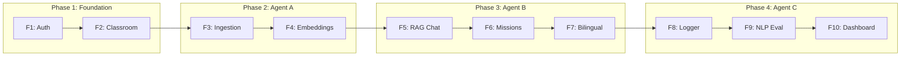

# Feature Catalog

Complete inventory of PrimePal features with status, descriptions, and key components.

---

## Core Features (Features 1-10)

### Feature 1: Smart Auth & Role Management
**Status**: Complete & Tested (14 tests)
**Phase**: 1 -- Foundation
**Description**: Dual-login system. Teachers use email/password via Supabase GoTrue. Students use a frictionless Class Code + Avatar + PIN entry for shared family smartphones.
**Components**:
- Backend: `backend/app/core/security.py` (create_student_token, decode_student_token, get_current_student, get_current_teacher, get_current_admin)
- Backend: `backend/app/api/v1/endpoints/auth.py` (GET /auth/classroom/{code}/avatars, POST /auth/student/login, PATCH /auth/student/profile, PATCH /auth/student/{id}/pin, GET /auth/me)
- Frontend: `frontend/app/teacher/login/page.tsx`, `frontend/app/student/play/page.tsx`, `frontend/app/student/play/avatar-select.tsx`
- SQL: `supabase/migrations/001_feature1_auth.sql` (teachers, classrooms, students tables + RLS)

### Feature 2: Classroom Manager (The Registry)
**Status**: Complete & Tested (10 tests)
**Phase**: 1 -- Foundation
**Description**: Digital management hub for educators to generate class codes, manage student rosters via ghost profiles, and organize cohorts.
**Components**:
- Backend: `backend/app/api/v1/endpoints/classroom.py` (CRUD classrooms, bulk add students, remove students)
- Frontend: `frontend/app/teacher/classroom/page.tsx`, `frontend/app/teacher/classroom/[id]/page.tsx`
- Frontend: `components/teacher/CreateClassroomModal.tsx`, `components/teacher/BulkAddStudentsModal.tsx`
- SQL: `supabase/migrations/002_feature2_classroom.sql` (grade_level column, auto-generate class_code trigger)

### Feature 3: SNC Document Ingestion (Hybrid RAG Pipeline)
**Status**: Complete & Tested (13 tests)
**Phase**: 2 -- Agent A
**Description**: Content processing engine for SNC textbooks. Ingests PDFs, cleans/extracts text, chunks into AI-readable segments with curricular metadata.
**Components**:
- Backend: `backend/app/agents/curriculum_agent/ingestion.py` (clean_snc_text, chunk_documents)
- Backend: `backend/app/api/v1/endpoints/curriculum.py` (POST /curriculum/upload)
- Frontend: `components/teacher/FileUploadZone.tsx`
- SQL: `supabase/migrations/003_feature3_storage.sql` (snc-textbooks bucket)

### Feature 4: Vector Storage & Curricular Tagging
**Status**: Complete & Tested (7 tests)
**Phase**: 2 -- Agent A
**Description**: Converts SNC text chunks into vector embeddings tagged with metadata (grade level, book title). Uses pgvector with HNSW index for fast similarity search.
**Components**:
- Backend: `backend/app/agents/curriculum_agent/embedder.py` (embed_and_store_chunks)
- Backend: `backend/app/api/v1/endpoints/curriculum.py` (POST /curriculum/embed, integrated in /upload)
- SQL: `supabase/migrations/004_feature4_pgvector.sql` (snc_knowledge_base table, VECTOR(1536), HNSW index)
- SQL: `supabase/migrations/005_feature5_chat_rpc.sql` (match_snc_documents RPC with grade filter)

### Feature 5: Guardrailed Tutor (Student AI Chatbot)
**Status**: Complete & Tested (13 tests)
**Phase**: 3 -- Agent B
**Description**: RAG-grounded chat endpoint. Student messages are embedded, matched against grade-filtered SNC vectors, and answered by gpt-4o with strict vocabulary guardrails.
**Components**:
- Backend: `backend/app/agents/tutor_agent/chatbot.py` (retrieve_grade_filtered_chunks, get_guardrailed_response)
- Backend: `backend/app/api/v1/endpoints/chat.py` (POST /chat, POST /chat/stream)
- Frontend: `frontend/app/student/chat/page.tsx`

### Feature 6: Gamified Missions (Daily Questions UI)
**Status**: Complete & Tested (13 tests)
**Phase**: 3 -- Agent B
**Description**: 3 daily gamified English questions with points system. Multiple choice and fill-in-the-blank. +10 points per correct answer.
**Components**:
- Backend: `backend/app/agents/tutor_agent/mission_generator.py` (generate_daily_missions)
- Backend: `backend/app/api/v1/endpoints/missions.py` (GET /missions/daily, POST /missions/complete, GET /missions/me)
- Frontend: `frontend/app/student/missions/page.tsx`
- SQL: `supabase/migrations/006_feature6_gamification.sql` (points column on students)

### Feature 7: Bilingual Code-Switching Chatbot
**Status**: Complete & Tested (19 tests)
**Phase**: 3 -- Agent B
**Description**: Core conversational AI that processes Roman Urdu / Minglish input, translates to English for vector search, and responds bilingually. Single LLM call returns both Minglish and pure English replies.
**Components**:
- Backend: `backend/app/agents/tutor_agent/chatbot.py` (translate_to_english, TutorResponse, get_guardrailed_response updated)
- Backend: `backend/app/api/v1/endpoints/chat.py` (updated pipeline with translation step)
- Frontend: `frontend/app/student/chat/page.tsx` (per-bubble language toggle)

### Feature 8: Multi-Modal Interaction Logger
**Status**: Complete & Tested (7 tests)
**Phase**: 4 -- Agent C
**Description**: Background tracking system recording every student-AI interaction. Captures text submissions, audio transcriptions, correctness, and pillar data.
**Components**:
- Backend: `backend/app/agents/evaluator_agent/interaction_logger.py` (log_interaction)
- Backend: `backend/app/api/v1/endpoints/chat.py` (BackgroundTask hook)
- Backend: `backend/app/api/v1/endpoints/missions.py` (BackgroundTask hook)
- SQL: `supabase/migrations/007_feature8_interactions.sql` (student_interactions table)

### Feature 9: NLP Insight Generator
**Status**: Complete & Tested
**Phase**: 4 -- Agent C
**Description**: Automated evaluator that parses interaction logs and generates structured insight reports per student using LLM analysis.
**Components**:
- Backend: `backend/app/agents/evaluator_agent/nlp_evaluator.py` (evaluate_interactions, StudentInsightReport)
- Backend: `backend/app/api/v1/endpoints/evaluator.py`

### Feature 10: Four-Skill Action Plan Dashboard
**Status**: Complete
**Phase**: 4 -- Agent C
**Description**: Teacher-facing web interface translating NLP metrics into actionable progress reports. Shows class-wide trends and per-student reports.
**Components**:
- Frontend: `frontend/app/teacher/dashboard/page.tsx`
- Frontend: `frontend/app/teacher/analytics/page.tsx`

---

## Extended Features

### Feature 11: 4-Pillar Kahoot-Style LMS
**Status**: Complete & Tested
**Description**: Full multi-pillar mission system with 10 questions per pillar, 13 task types, adaptive difficulty, 15-second timer gameplay, and curriculum-aligned AI generation.
**Components**:
- Backend: `backend/app/agents/tutor_agent/mission_generator.py` (generate_pillar_missions, PILLAR_TASK_CONFIGS)
- Backend: `backend/app/api/v1/endpoints/missions.py` (GET /missions with pillar param)
- Backend: `backend/app/api/v1/endpoints/interactions.py` (POST /interactions batch logging)
- Frontend: `frontend/app/student/missions/page.tsx` (2x2 pillar card grid)
- Frontend: `frontend/app/student/missions/[pillar]/page.tsx` (gameplay with timer)

### Spelling Bee
**Status**: Complete
**Description**: Audio TTS + typed spelling with accuracy scoring. LLM generates 10 grade-appropriate words per active topic. Points: 10 (1st attempt), 5 (2nd), 0 (wrong).
**Components**:
- Backend: `backend/app/api/v1/endpoints/spelling_bee.py` (GET /spelling-bee/words, POST /spelling-bee/submit)
- Frontend: Student spelling UI

### Story Time
**Status**: Complete
**Description**: LLM-generated short stories (4-6 sentences) with 3 comprehension questions and TTS read-aloud.
**Components**:
- Backend: `backend/app/api/v1/endpoints/story_time.py` (GET /story-time/story, POST /story-time/answer)
- Frontend: Student reading UI

### Speaking Practice
**Status**: Complete
**Description**: Web SpeechRecognition + LLM transcript evaluation. Includes basic text eval and pro word-level pronunciation analysis via Whisper.
**Components**:
- Backend: `backend/app/api/v1/endpoints/speaking.py` (GET /speaking/prompts, POST /speaking/evaluate, POST /speaking/evaluate-pro)
- Backend: `backend/app/utils/pronunciation.py` (compare_phrases, calculate_pronunciation_score)

### Quests Page
**Status**: Complete
**Description**: 4-pillar weekly progress tracker with 7-day rolling window.
**Components**:
- Frontend: `frontend/app/student/quests/page.tsx`

### Student Leaderboard
**Status**: Complete
**Description**: Classroom ranking by points with podium top-3 display.

### Surprise Daily Chest (Loot Box)
**Status**: Complete
**Description**: Anti-cheat daily reward system. 70% +25 stars, 20% +50 stars, 10% 2x multiplier. Server-side UTC timestamp validation.
**Components**:
- Backend: `backend/app/api/v1/endpoints/rewards.py` (POST /rewards/claim-daily, GET /rewards/status, GET /rewards/daily-summary, GET /rewards/streak)

### Evolving Worlds (Dynamic Backgrounds)
**Status**: Complete
**Description**: Day/night cycle + 3-tier journey system with Framer Motion animations on the student home page.

### Teacher Dashboard v2
**Status**: Complete
**Description**: 4-stat KPIs, At-Risk student widget, 6 quick action buttons.

### Student Directory
**Status**: Complete
**Description**: Global student search/filter with stats across all classrooms.

### Student Report Cards
**Status**: Complete
**Description**: AI-powered per-student pillar reports with PDF export capability.

### Admin Role System
**Status**: Complete
**Description**: School-wide admin with invite codes, audit log, and elevated permissions.
**Components**:
- Backend: `backend/app/api/v1/endpoints/admin.py`
- Backend: `backend/app/core/security.py` (get_current_admin)

---

## Feature Architecture by Phase

