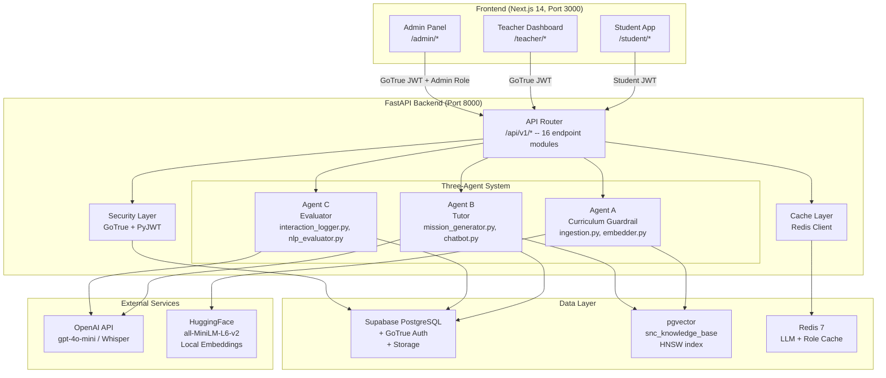

# System Architecture

PrimePal follows a three-tier architecture: a Next.js 14 frontend, a FastAPI backend orchestrating three AI agents, and Supabase (PostgreSQL + pgvector) as the persistence layer with Redis for caching.

---

## High-Level Architecture

---

## Component Overview

### Frontend (Next.js 14)
- **App Router** with explicit route directories: `teacher/`, `student/`, `admin/`
- Root layout (`frontend/app/layout.tsx`) wraps everything in `QueryProvider` for React Query
- Uses Geist Sans/Mono fonts, Tailwind CSS for styling
- **Student UI**: Mobile-first, gamified with Framer Motion animations, large tap targets, confetti
- **Teacher UI**: Desktop dashboard with analytics, classroom management, curriculum upload
- **Auth paths**: Supabase JS session for teachers/admins, `localStorage` JWT for students

### Backend (FastAPI)
- **Entrypoint**: `backend/app/main.py` -- FastAPI app with CORS middleware and Redis lifespan
- **Configuration**: `backend/app/core/config.py` -- pydantic-settings reading from `.env`
- **16 endpoint modules** registered under `/api/v1/` in `backend/app/api/v1/router.py` (a dead `tutor.py` stub file also exists but is not wired into the router)
- **Three AI agents** in `backend/app/agents/` -- each has its own subdirectory
- **Security**: `backend/app/core/security.py` -- three FastAPI dependencies: `get_current_student()`, `get_current_teacher()`, `get_current_admin()`
- **Supabase client**: `backend/app/core/supabase_client.py` -- `get_supabase()` (anon) and `get_supabase_admin()` (service role, bypasses RLS)
- **Redis caching**: `backend/app/core/cache.py` -- `init_redis()`, `cache_get()`, `cache_set()`, `make_cache_key()`

### Data Layer
- **Supabase PostgreSQL**: Core tables (`teachers`, `classrooms`, `students`, `student_interactions`, `snc_knowledge_base`, `snc_uploads`, `classroom_syllabus`, `snc_topics`, `achievements`, etc.)
- **pgvector**: `snc_knowledge_base` with `VECTOR(384)` embedding column (MiniLM all-MiniLM-L6-v2, switched from 1536-dim OpenAI in migration 008), HNSW index (cosine similarity), GIN index on metadata JSONB for grade pre-filtering
- **Redis**: Best-effort caching for teacher roles (1h TTL), daily summaries (2min TTL), LLM outputs
- **Supabase Storage**: `snc-textbooks` private bucket for raw PDF archival

### Docker Compose (`docker-compose.yml`)
- `redis:7-alpine` on port 6379 with healthcheck (`redis-cli ping`)
- `backend` on port 8000, depends on Redis healthy
- Environment variables injected from `.env`: `SUPABASE_URL`, `SUPABASE_ANON_KEY`, `SUPABASE_SERVICE_ROLE_KEY`, `OPENAI_API_KEY`, `STUDENT_JWT_SECRET`, `DATABASE_URL`

---

## Key Design Decisions

### 1. Dual Authentication
Teachers use Supabase GoTrue. Students use custom PyJWT because they are ghost profiles without emails. See [auth-flows.md](auth-flows.md).

### 2. Supabase as Unified Backend
Everything in one Supabase instance: relational data, vector embeddings (pgvector), file storage, and teacher authentication.

### 3. Local Embeddings (HuggingFace)
`all-MiniLM-L6-v2` runs locally (no API costs). 384-dimensional vectors stored in pgvector.

### 4. Three-Agent Separation
Agent A processes curriculum (never touches students). Agent B serves students (receives pre-filtered context). Agent C observes and reports (never generates content).

### 5. Redis as Best-Effort Cache
All cache operations wrapped in try/except. Redis failure never crashes the app.

### 6. Grade-Level Guardrail (Three-Layer)
SQL RPC pre-filters by grade, endpoint resolves grade from DB, LLM prompt enforces vocabulary limits. See [data-flow.md](data-flow.md).

### 7. Structured LLM Output
All LLM calls producing structured data use `ChatOpenAI.with_structured_output(PydanticModel)` for guaranteed schema-valid JSON.

### 8. Background Interaction Logging
`FastAPI BackgroundTasks` + synchronous `log_interaction()` in thread pool. Error-swallowing by design.

---

## Sub-Pages

| File | Description |
|---|---|
| [agent-system.md](agent-system.md) | Three-agent AI architecture with function signatures |
| [auth-flows.md](auth-flows.md) | Dual auth: Supabase GoTrue + custom PyJWT |
| [data-flow.md](data-flow.md) | Request lifecycle diagrams for all major flows |
| [features.md](features.md) | Complete feature catalog with status |
